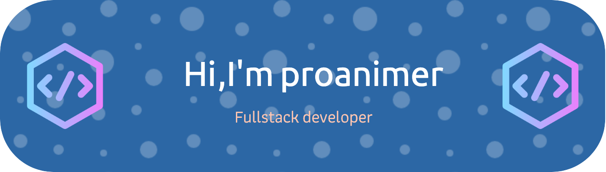

### <div align="center">Hi there👋. I'm @drowning-in-codes, a student from China.</div>  
  

- 🔭 I’m currently working on Web, Java, Python, App development  
  

- 🌱 I’m currently learning Web, Java, Flutter, Electron  
  

- ⚡ I love Anime  
<div>
  <a href="http://sekyoro.top"></a>
  <a href="http://www.proanimer.com"></a>
  <div>  </div>
</div>

<div></div>
<br/> 

<div >

</div>
<!--START_SECTION:waka-->

```text
From: 13 February 2023 - To: 13 July 2023

Total Time: 250 hrs 29 mins

Python           93 hrs 19 mins  >>>>>>>>>----------------   37.25 %
Jupyter          65 hrs          >>>>>>-------------------   25.95 %
JavaScript       34 hrs 8 mins   >>>----------------------   13.63 %
C++              31 hrs 38 mins  >>>----------------------   12.63 %
HTML             7 hrs 59 mins   >------------------------   03.19 %
JSON             3 hrs 29 mins   -------------------------   01.40 %
Other            2 hrs 50 mins   -------------------------   01.13 %
```

<!--END_SECTION:waka-->

## My Skill Set  
<table><tr><td valign="top" width="33%">

### Frontend  
<div align="center">  
<a href="https://getbootstrap.com/docs/3.4/javascript/" target="_blank"></a>  
<a href="https://www.w3schools.com/css/" target="_blank"></a>  
<a href="https://en.wikipedia.org/wiki/HTML5" target="_blank"></a>  
<a href="https://www.electronjs.org/" target="_blank"></a>  
<a href="https://www.javascript.com/" target="_blank"></a>  
<a href="https://www.typescriptlang.org/" target="_blank"></a>  
<a href="https://vuejs.org/" target="_blank"></a>  
<a href="https://mui.com/" target="_blank"></a>  
<a href="https://www.djangoproject.com/" target="_blank"></a>  
<a href="https://flutter.dev/" target="_blank"></a>  
</div>

</td><td valign="top" width="33%">


### Backend  
<div align="center">  
<a href="https://www.cplusplus.com/" target="_blank"></a>  
<a href="https://nodejs.org/" target="_blank"></a>  
<a href="https://www.linux.org/" target="_blank"></a>  
<a href="https://www.nginx.com/" target="_blank"></a>  
<a href="https://www.python.org/" target="_blank"></a>  
<a href="https://www.java.com/" target="_blank"></a>  
<a href="https://docs.microsoft.com/en-us/dotnet/csharp/" target="_blank"></a>  
</div>

</td><td valign="top" width="33%">


### DevOps  
<div align="center">  
<a href="https://www.linux.org/" target="_blank"></a>  
<a href="https://github.com/" target="_blank"></a>  
<a href="https://www.docker.com/" target="_blank"></a>  
</div>

</td></tr></table>  

<br/>  


## Connect with me  
<div align="center">
<a href="https://github.com/drowning-in-codes" target="_blank">

</a>  
 <a href="mailto:bukalala174@gmail.com" target="_blank">

</a>  
</div>  
  

<br/>  


## Github Stats  

<div align="center"> </div> 
<div>

 
</div>

<br/>

<div align="center">  </div>
<br/>  

[](https://github.com/ashutosh00710/github-readme-activity-graph)


## Spotify Listening  
  
<br/>

<div align="center"></div> 
<br/>  

<div align="center">

</div>  

<br/>  

<div align="center">
            <a href="https://www.buymeacoffee.com/drowning-in-codes" target="_blank" style="display: inline-block;">
                
            </a></div>

      
<br />

