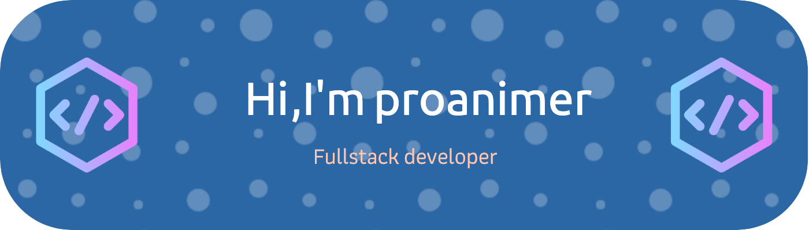

### <div align="center">Hi there👋. I'm @drowning-in-codes, focusing on building and exploring AI and FullStack development.</div>  

🏫 Research-wise, I mainly focus on:
- **Generative AI** and **LLM**.
- **Collaborative Perception** with Autonomous Driving.
- Fun Stuff related to Deep Learning.

💻 Develop-wise, I mainly focus on: 
- **Web** development.  
- **Desktop and Mobile Application**.
- Cross-platform Application.

👐 I'm open to:
- any opportunities to collaborate.
- internships.

🍙 I write 
✨ AGI and simulate the world, plus I like anime.  
  


 | Proficiency | Programming Language |
|--------------|------|
| Master       |  |
| Advanced      | Python |
| Intermediate         | Javascript/Typescript, Go, Java, C/C++   |
| Basic         | C#, Dart, Kotlin, Rust  |
| willing to learn         |  Zig  |
<div>
  <a href="http://sekyoro.top"></a>
  <a href="http://www.proanimer.com"></a>
  <pciture>  </pciture>
  
  [](https://x.com/proanimer)
  [](https://huggingface.co/proanimer)
</div>

<picture></picture>

## Github summary


    
## Blog posts
<!-- BLOG-POST-LIST:START -->
- [搭建Agent+MCP+SKILL进行成熟Vibe Coding](https://www.sekyoro.top/2026/02/22/%E6%90%AD%E5%BB%BAAgent-MCP-SKILL%E8%BF%9B%E8%A1%8C%E6%88%90%E7%86%9FVibe-Coding/)
- [分布式IM聊天系统学习](https://www.sekyoro.top/2026/02/13/%E5%88%86%E5%B8%83%E5%BC%8FIM%E8%81%8A%E5%A4%A9%E7%B3%BB%E7%BB%9F%E5%AD%A6%E4%B9%A0/)
- [AI工具尝鲜:从&quot;模态爆发&quot;到&quot;生态耕耘&quot;](https://www.sekyoro.top/2026/02/11/AI%E5%B7%A5%E5%85%B7%E5%B0%9D%E9%B2%9C/)
- [Java、JVM、并发进阶](https://www.sekyoro.top/2026/02/02/Java%E3%80%81JVM%E3%80%81%E5%B9%B6%E5%8F%91%E8%BF%9B%E9%98%B6/)
- [经典算法题解析](https://www.sekyoro.top/2026/01/27/%E7%BB%8F%E5%85%B8%E7%AE%97%E6%B3%95%E9%A2%98%E8%A7%A3%E6%9E%90/)
<!-- BLOG-POST-LIST:END -->




<!--START_SECTION:waka-->


**🐱 My GitHub Data** 

> 📦 1.2 MB Used in GitHub's Storage 
 > 
> 🏆 40 Contributions in the Year 2026
 > 
> 💼 Opted to Hire
 > 
> 📜 34 Public Repositories 
 > 
> 🔑 6 Private Repositories 
 > 
**I'm a Night 🦉** 

```text
🌞 Morning                102 commits         ██░░░░░░░░░░░░░░░░░░░░░░░   06.38 % 
🌆 Daytime                340 commits         █████░░░░░░░░░░░░░░░░░░░░   21.25 % 
🌃 Evening                1092 commits        █████████████████░░░░░░░░   68.25 % 
🌙 Night                  66 commits          █░░░░░░░░░░░░░░░░░░░░░░░░   04.12 % 
```
📅 **I'm Most Productive on Thursday** 

```text
Monday                   185 commits         ███░░░░░░░░░░░░░░░░░░░░░░   11.56 % 
Tuesday                  202 commits         ███░░░░░░░░░░░░░░░░░░░░░░   12.62 % 
Wednesday                237 commits         ████░░░░░░░░░░░░░░░░░░░░░   14.81 % 
Thursday                 275 commits         ████░░░░░░░░░░░░░░░░░░░░░   17.19 % 
Friday                   224 commits         ████░░░░░░░░░░░░░░░░░░░░░   14.00 % 
Saturday                 222 commits         ███░░░░░░░░░░░░░░░░░░░░░░   13.88 % 
Sunday                   255 commits         ████░░░░░░░░░░░░░░░░░░░░░   15.94 % 
```


📊 **This Week I Spent My Time On** 

```text
🕑︎ Time Zone: Asia/Shanghai

💬 Programming Languages: 
YAML                     2 hrs 46 mins       █████████░░░░░░░░░░░░░░░░   37.06 % 
Nunjucks                 2 hrs 2 mins        ███████░░░░░░░░░░░░░░░░░░   27.30 % 
Other                    1 hr 5 mins         ████░░░░░░░░░░░░░░░░░░░░░   14.58 % 
Stylus                   36 mins             ██░░░░░░░░░░░░░░░░░░░░░░░   08.18 % 
JavaScript               33 mins             ██░░░░░░░░░░░░░░░░░░░░░░░   07.53 % 

🔥 Editors: 
VS Code                  7 hrs 28 mins       █████████████████████████   100.00 % 

🐱‍💻 Projects: 
next                     4 hrs 19 mins       ██████████████░░░░░░░░░░░   57.77 % 
blog                     1 hr 36 mins        █████░░░░░░░░░░░░░░░░░░░░   21.57 % 
next_old                 1 hr 9 mins         ████░░░░░░░░░░░░░░░░░░░░░   15.58 % 
Unknown Project          14 mins             █░░░░░░░░░░░░░░░░░░░░░░░░   03.16 % 
paicoding                8 mins              ░░░░░░░░░░░░░░░░░░░░░░░░░   01.87 % 

💻 Operating System: 
Windows                  7 hrs 28 mins       █████████████████████████   100.00 % 
```

**I Mostly Code in Python** 

```text
Python                   10 repos            ████████░░░░░░░░░░░░░░░░░   33.33 % 
Java                     3 repos             ██░░░░░░░░░░░░░░░░░░░░░░░   10.00 % 
JavaScript               3 repos             ██░░░░░░░░░░░░░░░░░░░░░░░   10.00 % 
PHP                      1 repo              █░░░░░░░░░░░░░░░░░░░░░░░░   03.33 % 
TypeScript               1 repo              █░░░░░░░░░░░░░░░░░░░░░░░░   03.33 % 
```


**Timeline**


 Last Updated on 19/03/2026 11:42:23 UTC
<!--END_SECTION:waka-->


## My Skill Set  
<table><tr><td valign="top" width="33%">

### Frontend  
<div align="center">  
<a href="https://www.javascript.com/" target="_blank"></a>
<a href="https://www.typescriptlang.org/" target="_blank"></a>  
<a href="https://reactjs.org/" target="_blank"></a>  
<a href="https://vuejs.org/" target="_blank"></a>
<a href="https://nextjs.org/" target="_blank"></a>  
<a href="https://nuxtjs.org/" target="_blank"></a>
<a href="https://www.electronjs.org/" target="_blank"></a> 
</div>
</td>
<td valign="top" width="33%">

### Backend  
<div align="center">  
<a href="https://www.cprogramming.com/" target="_blank"></a>  
<a href="https://www.cplusplus.com/" target="_blank"></a>
<a href="https://www.rust-lang.org/" target="_blank"></a> 
<a href="https://go.dev/" target="_blank"></a> 
<a href="https://www.java.com/" target="_blank"></a> 
<a href="https://docs.microsoft.com/en-us/dotnet/csharp/" target="_blank"></a>  
<a href="https://nodejs.org/" target="_blank"></a> 
<a href="https://www.python.org/" target="_blank"></a>  
</div>
</td><td valign="top" width="33%">

### Mobile  
<div align="center">  
<a href="https://dart.dev/" target="_blank"></a> 
<a href="https://kotlinlang.org/" target="_blank"></a>
<a href="https://flutter.dev/" target="_blank"></a>    
<a href="https://www.android.com/intl/en_in/" target="_blank"></a>
</div>
</td></tr></table>  

## Github Stats 
<table>
  <tr>
    <td valign="top"></td>
    <td valign="top"></td>
  </tr>
 </table>


<br/>
<p align="left">
  
  &nbsp;
  
</p>


[](https://github.com/ashutosh00710/github-readme-activity-graph)
<br/> 

[](https://spotify-github-profile.kittinanx.com/api/view?uid=i5xl3kzlvei96gtnf2ukn0yuu&redirect=true)


## Connect with me  
<div align="left">
<a href="mailto:bukalala174@gmail.com" style="text-decoration:none" target="_blank">
  
</a>

<a href="https://sekyoro.top/" style="text-decoration:none" target="_blank">
  
</a>
  
<a href="https://proanimer.com/" style="text-decoration:none" target="_blank">
  
</a>
  
<a href="https://www.linkedin.com/in/proanimer" style="text-decoration:none" target="_blank">
  
</a>
  
<a href="https://github.com/drowning-in-codes" style="text-decoration:none" target="_blank">
  
</a>
  
<a href="https://x.com/proanimer" style="text-decoration:none" target="_blank">
  
</a>
</div>  
<div align="center">
  <a href="https://www.buymeacoffee.com/bukalala172" target="_blank" style="display: inline-block;">
       
      </a>
</div>
<br />

