### <div align="center">Hi there👋. I'm @drowning-in-codes, a student from China.</div>  
  

- 🔭 I’m currently working on Web, Java, Python, App development  
  

- 🌱 I’m currently learning Web, Java, Flutter, Electron  
  
- ⚡ I love Anime

 | Proficiency | Programming Language |
|--------------|------|
| Master       |  |
| Advanced      | Python |
| Intermediate         | Javascript/Typescript, Java   |
| Basic         | C++,Go,C#,Dart   |
| willing to learn         | Kotlin,Rust   |
<div>
  <a href="http://sekyoro.top"></a>
  <a href="http://www.proanimer.com"></a>
  <pciture>  </pciture>

</div>

<pciture></pciture>
<br/> 

<picture></picture>
<picture></picture>

[](https://github.com/anuraghazra/github-readme-stats&layout=compact)

<!--START_SECTION:waka-->

```txt
From: 13 February 2023 - To: 22 December 2023

Total Time: 604 hrs 6 mins

Python           237 hrs 7 mins  >>>>>>>>>>---------------   39.25 %
JavaScript       128 hrs 45 mins >>>>>--------------------   21.31 %
C++              97 hrs 5 mins   >>>>---------------------   16.07 %
Jupyter          65 hrs 34 mins  >>>----------------------   10.85 %
HTML             13 hrs 36 mins  >------------------------   02.25 %
JSON             10 hrs 48 mins  -------------------------   01.79 %
CMake            7 hrs 37 mins   -------------------------   01.26 %
CSS              5 hrs 22 mins   -------------------------   00.89 %
Other            5 hrs 10 mins   -------------------------   00.86 %
Markdown         5 hrs 3 mins    -------------------------   00.84 %
```

<!--END_SECTION:waka-->




## My Skill Set  
<table><tr><td valign="top" width="33%">

### Frontend  
<div align="center">  
<a href="https://getbootstrap.com/docs/3.4/javascript/" target="_blank"></a>  
<a href="https://www.w3schools.com/css/" target="_blank"></a>  
<a href="https://en.wikipedia.org/wiki/HTML5" target="_blank"></a>  
<a href="https://www.electronjs.org/" target="_blank"></a>  
<a href="https://www.javascript.com/" target="_blank"></a>  
<a href="https://www.typescriptlang.org/" target="_blank"></a>  
<a href="https://vuejs.org/" target="_blank"></a>  
<a href="https://mui.com/" target="_blank"></a>  
<a href="https://www.djangoproject.com/" target="_blank"></a>  
<a href="https://flutter.dev/" target="_blank"></a>  
</div>

</td><td valign="top" width="33%">


### Backend  
<div align="center">  
<a href="https://www.cplusplus.com/" target="_blank"></a>  
<a href="https://nodejs.org/" target="_blank"></a>  
<a href="https://www.linux.org/" target="_blank"></a>  
<a href="https://www.nginx.com/" target="_blank"></a>  
<a href="https://www.python.org/" target="_blank"></a>  
<a href="https://www.java.com/" target="_blank"></a>  
<a href="https://docs.microsoft.com/en-us/dotnet/csharp/" target="_blank"></a>  
</div>

</td><td valign="top" width="33%">

### DevOps  
<div align="center">  
<a href="https://www.linux.org/" target="_blank"></a>  
<a href="https://github.com/" target="_blank"></a>  
<a href="https://www.docker.com/" target="_blank"></a>  
</div>
</td></tr></table>  
<br/>  
<picture>
  
</picture>

## Github Stats  
<picture>
  
</picture>
<picture>
  
</picture>


<br/>


<br/>  
[](https://github.com/ashutosh00710/github-readme-activity-graph)
<br/> 

[](https://github.com/kittinan/spotify-github-profile)
## Connect with me  
<div align="center">
<a href="https://github.com/drowning-in-codes" target="_blank">

</a>  
 <a href="mailto:bukalala174@gmail.com" target="_blank">

</a>  
</div>  
<div align="center">
            <a href="https://www.buymeacoffee.com/bukalala172" target="_blank" style="display: inline-block;">
                
            </a></div>
<br />

